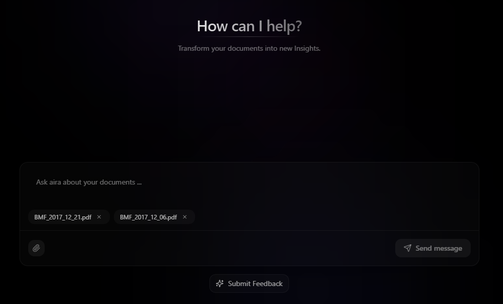

# Aira Chat

An **Agentic Information Retrieval Assistant** - A modern AI-powered chat interface built with Next.js that enables intelligent document-based conversations with file upload capabilities, multilingual support, and advanced UI interactions.



## Features

- 🤖 **AI-Powered Chat**: Interactive conversations with an intelligent AI assistant
- 📄 **Document Upload**: Support for PDF file uploads and document-based Q&A
- 🌐 **Multilingual Support**: Built-in internationalization with multiple language support
- 🎨 **Modern UI**: Beautiful, responsive interface with smooth animations using Framer Motion
- 💾 **Chat History**: Persistent chat history with feedback system
- 🔍 **Source Viewing**: View and reference source documents used in responses

## Tech Stack

- **Framework**: [Next.js 14](https://nextjs.org/) with App Router
- **Styling**: [Tailwind CSS](https://tailwindcss.com/) with custom design system
- **UI Components**: Custom component library with [Radix UI](https://radix-ui.com/) primitives
- **Animations**: [Framer Motion](https://framer.com/motion/) for smooth interactions
- **Type Safety**: TypeScript throughout the application
- **Icons**: [Lucide React](https://lucide.dev/) icon library

## Getting Started

### Prerequisites

- Node.js 18+
- npm, yarn, pnpm, or bun package manager

### Installation

1. Clone the repository:

```bash
git clone https://github.com/your-username/aira.git
cd aira/chat
```

2. Install dependencies:

```bash
npm install
# or
yarn install
# or
pnpm install
# or
bun install
```

3. Set up environment variables:

```bash
cp .env.template .env
```

4. Run the development server:

```bash
npm run dev
# or
yarn dev
# or
pnpm dev
# or
bun dev
```

Open [http://localhost:3000](http://localhost:3000) with your browser to see the result.

You can start editing the page by modifying `app/page.tsx`. The page auto-updates as you edit the file.

This project uses [`next/font`](https://nextjs.org/docs/app/building-your-application/optimizing/fonts) to automatically optimize and load [Geist](https://vercel.com/font), a new font family for Vercel.

## Learn More

To learn more about Next.js, take a look at the following resources:

- [Next.js Documentation](https://nextjs.org/docs) - learn about Next.js features and API.
- [Learn Next.js](https://nextjs.org/learn) - an interactive Next.js tutorial.

You can check out [the Next.js GitHub repository](https://github.com/vercel/next.js) - your feedback and contributions are welcome!

## Deploy on Vercel

The easiest way to deploy your Next.js app is to use the [Vercel Platform](https://vercel.com/new?utm_medium=default-template&filter=next.js&utm_source=create-next-app&utm_campaign=create-next-app-readme) from the creators of Next.js.

Check out our [Next.js deployment documentation](https://nextjs.org/docs/app/building-your-application/deploying) for more details.
